# Riassunto GIT

# Comandi

    git init
Crea un nuovo repository.

    git status
Mostra lo stato della working directory e della staging area.
    
    git config --global user.name "name"
    git config --global user.email email
Imposta chi sono io.
[Maggiori informazioni su git config](https://www.atlassian.com/git/tutorials/setting-up-a-repository/git-config
 "git config")

    git add
Organizza le modifiche del progetto che verranno salvate con un successivo commit nella staging area.

    git commit
Cattura uno snapshot del progetto con le modifiche salvate al momento nel repository locale.
Opzioni:
- --amend: sostituisce il commit più recente con uno nuovo a cui sono state applicate le modifiche salvate nella staging area. Sconsigliato per commit pubblici.
- --no-edit: permette di fare amend senza modificare il messaggio del commit.
##

Opzioni:
- -m "Messaggio"
- -a: salva automaticamente i file che sono stati modificati o cancellati, ma non aggiunge eventuali nuovi file se non è specificato
- --amend: modifica l'ultimo commit invece che crearne uno nuovo.
##
    git checkout 'id/nome'

Opzioni:
- -b: crea il branch, se non esiste già.
#

Ripristina la working directory ad un commit. Lo fa aggiornando il puntatore HEAD.

    git log
Mostra gli snapshot committati. Permette di vedere la cronologia del progetto, filtrarla e cercare specifiche modifiche.

    git branch
Permette di creare, listare, rinominare ed eliminare branch:
- Creare: git branch "nome"
- Cancellare: git branch -d "nome" (-D per forzare un branch non ancora completamente merged)
##

    git merge 'nome_branch'
Unisce il branch passato come argomento al branch attuale (precedentemente impostato con git checkout).

    git clone
Permette di ottenere una copia locale di un progetto precedentemente impostato in un repository centrale.

    git push
Aggiorna il repository centrale con le modifiche del repository centrale.

    git pull
Aggiorna il repository locale con le modifiche del repository centrale.
Opzioni:
- --rebase: effettua un rebase dei commit locali sulla punta del branch master dopo la sincronizzazione con le modifiche dal repository centrale.
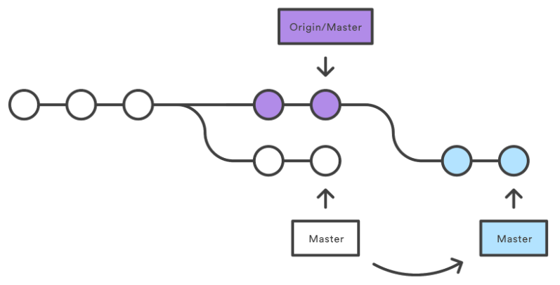
##

    git remote
Permette di creare, vedere ed eliminare connessioni ad altri repository:
- Creare: git remote add 'nome' 'URL'
- Eliminare: git remote rm 'nome'
- Rinominare: git remote rename 'old' 'new'
- Visualizzare: git remote show 'nome'

Opzioni:
- -v | --verbose: visualizza i nomi e i rispettivi URL.
##

    git remote add 'nome' 'URL'
In particolare, permette di collegare un repository locale, precedentemente creato con 'git init', ad un repository centrale.

    git push 'nome_remote' 'nome_branch'
Salva un branch che esiste solo localmente anche sul repository centrale puntato da 'nome_remote'

    git fetch --all
Effettua un fetch su tutti i remote registrati e i loro branch.

    git merge origin/master
Unisce i cambiamenti di un repository remoto con il proprio locale.

    git push 'remote' 'branch'
Carica il branch specificato nel repositori puntato da 'remote'.

    git rm 'filename'
Elimina il file specificato dal repository remoto e dal repository locale. Le modifiche effettuate da questo comando diventano persistenti solo una volta che si effettua un commit.

Opzioni:
- -f: ignora i controlli di sicurezza che fa git sul file, per assicurarsi che sia uguale nell'HEAD, staging area e working directory.
- -r: rimuove ricorsivamente i file contenuti in una directory.
- --cached: rimuove il file specificato solamente dal repository remoto.

##

    git stash
Salva momentaneamente le modifiche fatte sulla nostra copia di lavoro, per poter lavorare ad altro e ripristinarle in seguito.

Opzioni:
- -u: salva i file tracked ed untracked.
- -a: salva i file tracked, untracked e ignorati.
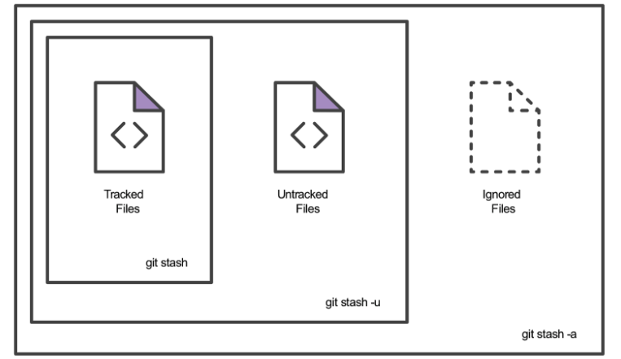
##

    git stash pop
Riapplica le modifiche salvate precedentemente con 'git stash'.

    git rebase 'branch_base'
Riapplica i commit del branch attuale all'HEAD del branch passato.

Opzioni:
- -i: effettua un rebasing interattivo.
- --continue: in caso di rilevamento di conflitti, continua.
- --abort: in caso di rilevamento di conflitti, abortisce il processo.
##

    git rebase --interactive
Effettua un rebasing interattivo.

Opzioni:
- p | pick: mantiene il commit.
- r | reword: modifica il messaggio di un commit.
- s | squash: unisce il commit a quello precedente e chiede di inserire un nuovo messaggio.
- f | fixup: ignora il messaggio del commit e lo unisce al commit precedente.
- e | edit: mantiene il commit, ma si ferma per fare amend.

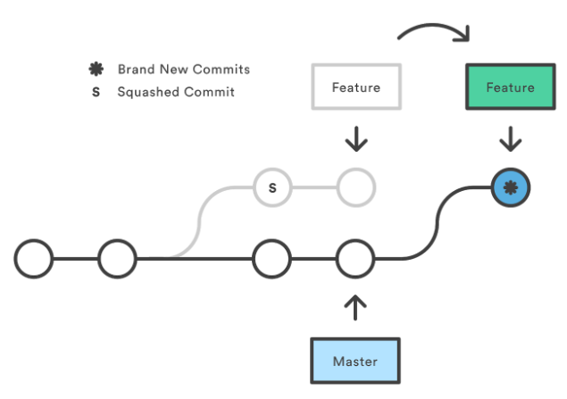

Se si elimina la riga di un commit dall'editor di testo, tale commit verrà perso.
Se si eliminano tutte le righe, la procedura di rebase verrà abortita.
##

    git tag 'nome_tag'
Crea un tag di tipo lightweight al commit HEAD.

Opzioni:
- -a: crea un tag di tipo annotated.
- -m "Messaggio".
- -d 'tag': cancella il tag passato.
##

    git tag
Visualizza la lista dei tag salvati nel repository.

    git tag -a 'nome' 'id_commit'
Crea un tag associato al commit passato.

    git config
Permette di configurare l'installazione locale. Si possono configurare:
- informazioni dell'utente;
- preferenze;
- il comportamento di un repository.

Opzioni:
- --local: le modifiche passate saranno impostate solo per il repository locale corrente.
- --global: le modifiche passate saranno impostate per l'utente corrente.
- --system: le modifiche passate saranno impostate per tutti gli utenti sulla macchina corrente.
- --edit: apre il file di configurazione.
##

    git diff
Di default visualizza le modifiche non committate, dall'ultimo commit.

Possibili utilizzi:
- git diff 'commit_1' 'commit_2': confronta due commit, si possono passare come riferimenti ai commit HEAD, tag, nomi di branch.
- git diff 'branch_1' 'branch_2' 'nome_file': confronta uno specifico file passato come argomento.
##

    git reset
Muove la punta di un branch ad uno specifico commit. Di default resetta la staging area al commit più recente, lascia invece inalterata la working directory.

Possibili utilizzi:
- git reset 'commit' (o 'branch')

Opzioni:
- --soft: lo snapshot nella stagind area e la working directory attualmente mostrati non sono modificati.
- --mixed: lo snapshot attuale viene aggiornato al nuovo commit specificato, la working directory non viene invece modificata.
- --hard: sia lo snapshot che la working directory vengono aggiornati al commit specificato.

##

    git revert
Crea un nuovo commit che annulla le modifiche effettuate, permettendo di mantenere traccia della cronologia di tutte le modifiche.

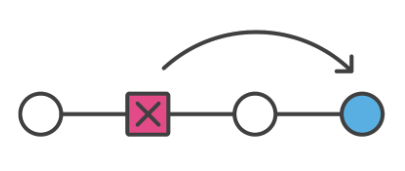

# Definizioni

#### branch
E' un puntatore ad un commit, non ha un nome leggibile. I branch sono utili quando si introduce una nuova feature o si fixa un bug per evitare di introdurre codice instabile nel main branch. In questo modo un branch può rappresentare una serie di commit.

##### master branch
E' il branch di default creato alla creazione del repository.

##### HEAD
E' un puntatore alla versione attuale del commit. All'inizio punta al master.

#### Merging di branch
E' il processo tramite il quale la cronologia biforcata in diversi merge viene riunita nella main code base.

##### fast-forward merge
Si può utilizzare quando esiste un percorso lineare dal branch corrente al branch di destinazione (il branch di destinazione deriva dal branch corrente). Semplicemente git muove il puntatore in avanti al branch di destinazione.

##### 3-way-merge
Il fast-forward merge non è possibile se i branch hanno delle divergenze. Questo metodo utilizza un terzo merge in cui unire i due branch. E' più utilizzato per unire feature molto grandi e di lunga durata di sviluppo.

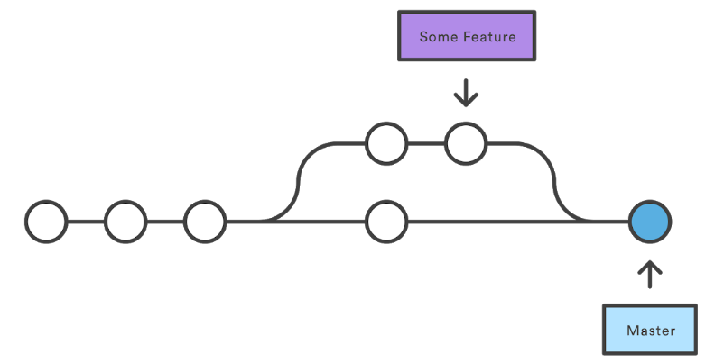

##### Risolvere i conflitti di merging
Se in entrambi i branch che si intende unire si è modificata la stessa parte dello stesso file, git non sarà in grado di capire quale mantenere. In questo caso è necessario risolvere il conflitto manualmente. "git status" può essere utile in questo caso per vedere quali file hanno bisogno di essere risolti.

#### Git remote
E' un modo facile per passare URL a comandi come git push e pull. Quando si fa 'git clone', automaticamente viene creata una connessione remota chiamata origin, che punta al repository clonato, facilitando una successiva operazione 'git pull'. Le connessioni remote non sono altro che dei "Bookmark", un modo per riferirsi tramite dei semplici nomi a degli URL.

#### Fetch
Git fetch scarica i commit ed i file da un repository remoto al locale. Si usa 'git fetch' quando si intende vedere su cosa ha lavorato qualcun altro, non ci forza a fare un merge con le modifiche attualmente presenti attualmente in locale. Git fetch non ha assolutamente alcun effetto sul lavoro locale. I contenuti fetchati vanno poi esplicitamente checkati con git checkout.

#### Pull
Combina un 'git fetch' e unisce il contenuto del repository remoto con l'HEAD in un nuovo merge commit locale.

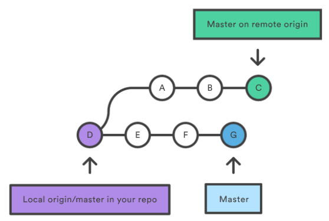
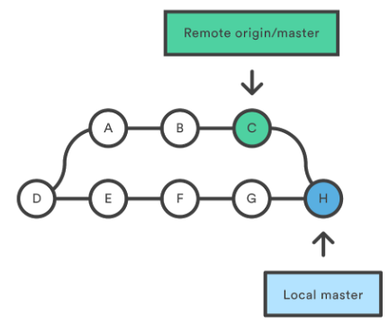

#### Push
Carica il contenuto del repository locale in un repository remoto. E' la controparte di 'git fetch'. Git non permette di effettuare il push se il merge non sarà di tipo fast-forward. In tal caso, prima si deve fare 'git pull' e risolvere i conflitti, infine rieseguire 'git pull', oppure si può  utilizzare l'opzione --force.

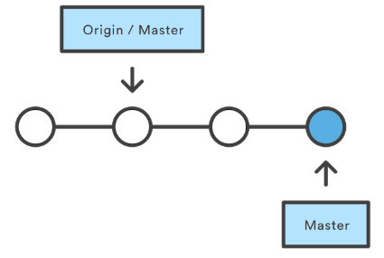
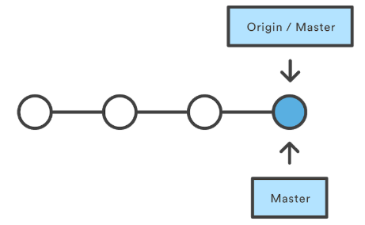

#### Ignorare file
I file nella nostra directory locale possono essere di tre tipi:
- Tracked: precedentemente committati.
- Untracked: file non committati.
- Ignored: file che a Git è stato esplicitamente detto di ignorare.

Sono solitamente file compilati o file generati dalla macchina.

Per ignorare un file si deve aggiungere manualmente al file '.gitignore', che dev'essere poi committato. Nel file .gitignore è possibile aggiungere commenti utilizzando il carattere '#'.

#### Stashing
Il comando 'git stash' ripone momentaneamente le modifiche fatte sulla nostra copia di lavoro, per poter lavorare su qualcos'altro ed in seguito tornare indietro e riapplicarle più tardi. E' molto utile quando si deve cambiare contesto e lavorare su altro, ma si è a metà di un cambiamento nel codice che non si è però pronti a committare. In pratica 'git stash' salva le modifiche attualmente non committate per un futuro utilizzo e le rimuove dalla cartella di lavoro attuale.

#### Rebasing
E' il processo che permette di muovere o combinare una sequenza di commit ad un nuovo commit di base. E' particolarmente utile quando si sta lavorando ad una feature in un branch secondario e si intende unirla al branch master. Invece che effettuare un merge diretto, si può fare un rebasing del branch secondario e successivamente fare il merge. Nel secondo caso il merge sarà di tipo fast-forward  e la cronologia risulterà più lineare.

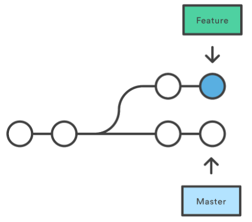
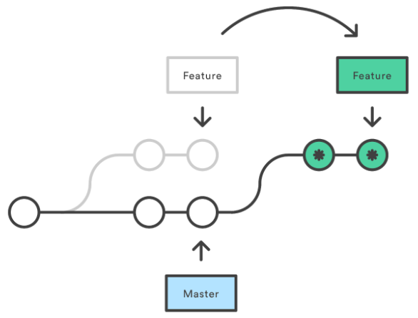

Per effettuare il rebasing git crea dei nuovi commit e li applica alla nuova base, il branch risultante sarà quindi composto di branch completamente nuovi rispetto a quello di partenza.

Risulta molto comodo anche per aggiornare il proprio repository locale con le modifiche del repository remoto. Git pull effettua infatti un merge commit superfluo ogni volta,  evitabile con il rebasing del branch locale. Inoltre è come affermare: "voglio basare i miei cambiamenti su ciò che tutti gli altri hanno già fatto".

Effettuando il rebasing è possibile incorrere in conflitti. Si può rimediare effettuando il rebasing frequentemente.

###### Rebasing interattivo
Permette di modificare individualmente i commit che compongono il branch. Permette quindi di ottenere una cronologia più pulita rimuovendo, dividendo o modificando una serie esistente di commit. Il risultato sarà che al pubblico risulterà che la feature è stata sviluppata in una singola serie di ben pianificati commit.

#### Tagging
I tag sono dei riferimenti a punti specifici della cronologia. I tag sono solitamente utilizzati per marcare un punto che corrisponde ad una release.
Di default, 'git push' non pusha i tag, devono essere quindi passati esplicitamente al comando:

    git push origin 'nome_tag'

E' possibile spostarsi al commit referenziato da un tag tramite 'git checkout nome_tag'.

###### Tag annotated
Oltre al nome del tag, permette di salvare altri metadati, quali il nome del tagger, l'email, la data, ...

Una best practice è quella di considerare i tag lightweight come privati e quelli annotated come pubblici.

#### Blaming
E' un'utility per il troubleshootin. E' utilizzata per visualizzare i metadati allegati ad una specifica linea in un file committato.

Solitamente il blaming è effettuato tramite una GUI su siti quali github o bitbucket.

#### git config: Configurazione e setup
Git salva le configurazioni in tre file, per poter decidere l'ambito a cui si riferiscono:
- locale rispetto ad un repository;
- globale rispetto all'utente;
- di sistema.

#### Fork vs Clone
Un fork di un repository non è altro che un clone server-side, generalmente gestito ed hostato da una parte terza rispetto al progetto ufficiale.

#### Git Workflows
E' un insieme di linee guida su come utilizzare Git per realizzare il lavoro in modo coerente e produttivo. Esistono molti workflow diversi, è importante sceglierlo in base alla cultura del team di lavoro, per evitare che diventi una limitazione alla produttività.

E' importante considerare alcuni aspetti quando si valuta un workflow:
- E' scalabile rispetto alla dimensione del team?
- E' facile cancellare gli errori con questo workflow?
- Questo workflow impone un inutile sovraccarico cognitivo al team?

##### Workflow centralizzato
Il branch di lavoro di default è chiamato master e tutte le modifiche sono committate in questo branch. Non prevede altri branch al di fuori del master. E' consigliabile per team molto piccoli. Il repository centrale è il progetto, quindi la sua cronologia deve essere trattata come sacra ed immutabile.

##### Feature Beanch Workflow
Lo sviluppo di ogni feature deve avvenire in un branch dedicato, invece che sul master. Questo workflow permette ad ogni sviluppatore di lavorare ad una feature senza disturbare la main codebase. Inoltre, il branch master non conterrà mai codice buggato o mal funzionante.

I nomi dei branch devono essere esplicativi riguardo alla feature. I branch possono essere pushati sul repository centrale, senza intaccare il branch master in alcun modo, permettendo di condividere lo sviluppo di una feature con altri componenti del team.

Azioni per la creazione di un branch dedicato ad una feature:
- Si parte dal branch master aggiornato all'ultima versione dal repository centrale.
- Si crea il nuovo branch.
- Si lavora allo sviluppo della feature nel branch precedentemente creato.
- Si pusha il nuovo branch sul repository centrale, per avere una copia di backup e per permettere la collaborazione con altri sviluppatori del team.
- Pull request.

###### Pull request
Al termine dello sviluppo della feature, invece che effettuare immediatamente il merge del branch con il master, si effettua una 'pull request': una richiesta di unione del branch con la feature con il master. Questo procedimento permette agli altri sviluppatori di revisionare il codice prima che diventi parte della main codebase.

##### Gitflow Workflow
Questo workflow definisce un rigido modello di branching, sviluppato attorno alla release del progetto. Questo permette di avere una struttura robusta per lo sviluppo di progetti molto grandi.E' particolarmente indicato per progetti che hanno un ciclo di release ben definito.

Questo workflow è molto simile al 'Feature Beanch Workflow', in aggiunta però assegna dei ruoli specifici ai branch e definisce come e quando devono interagire tra loro. Oltre ai branch previsti dal FBW, prevede l'utilizzo di branch specifici ed individuali per preparare, mantenere e registrare le release.

Invece che utilizzare solamente il singolo branch master, per registrare la cronologia del progetto, ne usa due:
- master branch: contiene la cronologia delle release ufficiali.
- develop branch: serve da branch per l'integrazione delle feature.

Si utilizzano i tag su ogni commit nel branch master, con il numero di versione della release.

Principi:
- Le feature non devono mai interagire direttamente con il branch master.
- Quando sono state sviluppate abbastanza feature per fare una release, oppure si sta avvicinando la scadenza della prossima release, si fa un fork del branch develop per creare un nuovo branch release. Non si possono fare merge di feature su un branch release, si possono solo effettuare modifiche per bug-fix, documentazione e altre azioni orientate alla release. Quando la release sarà pronta si effettuerà un merge con il branch master e con il branch develop.
- Sono previsti dei branch per effettuare degli hotfix: patchare velocemente una release in produzione. I branch hotfix sono creati con fork del branch master. Una volta che l'hotfix è completato si effettua il merge nel branch master.

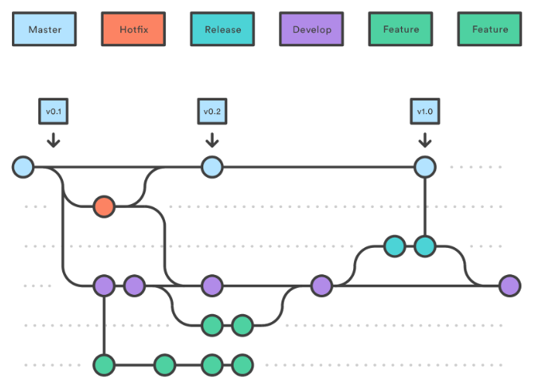

##### Forking Workflow
Ogni sviluppatore ha il proprio repository centrale, oltre al repository centrale comune. E' particolarmente utilizzato nello sviluppo di codice pubblico per progetti open-source. Con questo workflow, ogni sviluppatore può pushare modifiche solo sul suo repository centrale, e solamente il manutentore del progetto sarà in grado di pushare modifiche sul repository centrale comune. Questo permette al manutentore del progetto di accettare commit dagli sviluppatori, senza dovergli dare il permesso di scrittura sul repository ufficiale comune.

Azioni dello sviluppatore, per contribuire allo sviluppo:
- Fork del repository centrale ufficiale.
- Clone del repository personale in locale.
- Si aggiunge un remote per il repository ufficiale.
- Si crea un nuovo branch feature.
- Lo sviluppatore crea e committa le modifiche nel branch feature.
- Il branch feature viene pushato sul repository personale dello sviluppatore.
- Lo sviluppatore apre una 'pull request' al repository ufficiale.
- La 'pull request' viene approvata ed è unita al repository ufficiale.