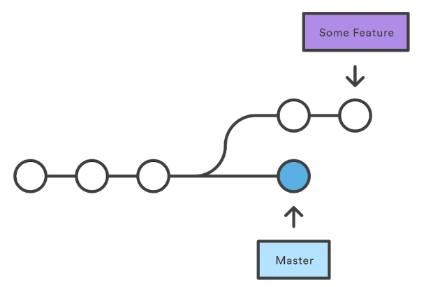

# Riassunto GIT
***

# Comandi

    git init
Crea un nuovo repository.

    git status
Mostra lo stato della working directory e della staging area.
    
    git config --global user.name "name"
    git config --global user.email email
Imposta chi sono io.
[Maggiori informazioni su git config](https://www.atlassian.com/git/tutorials/setting-up-a-repository/git-config
 "git config")

    git add
Organizza le modifiche al progetto che verranno salvate con un successivo commit.

    git commit
Cattura uno snapshot del progetto con le modifiche salvate al momento nel repository locale.

Parametri:
- -m "Messaggio"
- -a: salva automaticamente i file che sono stati modificati o cancellati, ma non aggiunge eventuali nuovi file se non è specificato
- --amend: modifica l'ultimo commit invece che crearne uno nuovo.
##
    git checkout <id/nome>

Ripristina la working directory ad un commit. Lo fa aggiornando il puntatore HEAD.

    git log
Mostra gli snapshot committati. Permette di vedere la cronologia del progetto, filtrarla e cercare specifiche modifiche.

    git branch
Permette di creare, listare, rinominare ed eliminare branch:
- Creare: git branch "nome"
- Cancellare: git branch -d "nome" (-D per forzare un branch non ancora completamente merged)

    git merge <nome_branch>
Unisce il branch passato come argomento al branch attuale (precedentemente impostato con git checkout).

    git clone
Permette di ottenere una copia locale di un progetto precedentemente impostato in un repository centrale.

    git push
Aggiorna il repository centrale con le modifiche del repository centrale.

    git pull
Aggiorna il repository locale con le modifiche del repository centrale.

    git remote
Permette di creare, vedere ed eliminare connessioni ad altri repository:
- Creare: git remote add <nome> <URL>
- Eliminare: git remote rm <nome>
- Rinominare: git remote rename <old> <new>
- Visualizzare: git remote show <nome>

Parametri:
- -v | --verbose: visualizza i nomi e i rispettivi URL.

    git remote add <nome> <URL>
In particolare, permette di collegare un repository locale, precedentemente creato con 'git init', ad un repository centrale.

    git push <nome_remote> <nome_branch>
Permette di salvare un branch che esiste solo localmente anche sul repository centrale puntato da <nome_remote>

# Definizioni

#### branch
E' un puntatore ad un commit, non ha un nome leggibile. I branch sono utili quando si introduce una nuova feature o si fixa un bug per evitare di introdurre codice instabile nel main branch. In questo modo un branch può rappresentare una serie di commit.

##### master branch
E' il branch di default creato alla creazione del repository.

##### HEAD
E' un puntatore alla versione attuale del commit. All'inizio punta al master.

#### Merging di branch
E' il processo tramite il quale la cronologia biforcata in diversi merge viene riunita nella main code base.

##### fast-forward merge
Si può utilizzare quando esiste un percorso lineare dal branch corrente al branch di destinazione (il branch di destinazione deriva dal branch corrente). Semplicemente git muove il puntatore in avanti al branch di destinazione.

##### 3-way-merge
Il fast-forward merge non è possibile se i branch hanno delle divergenze. Questo metodo utilizza un terzo merge in cui unire i due branch. E' più utilizzato per unire feature molto grandi e di lunga durata di sviluppo.

##### Risolvere i conflitti di merging
Se in entrambi i branch che si intende unire si è modificata la stessa parte dello stesso file, git non sarà in grado di capire quale mantenere. In questo caso è necessario risolvere il conflitto manualmente. "git status" può essere utile in questo caso per vedere quali file hanno bisogno di essere risolti.

#### Git remote
E' un modo facile per passare URL a comandi come git push e pull. Quando si fa 'git clone', automaticamente viene creata una connessione remota chiamata origin, che punta al repository clonato, facilitando una successiva operazione 'git pull'. Le connessioni remote non sono altro che dei "Bookmark", un modo per riferirsi tramite dei semplici nomi a degli URL.

#### Nuovo repository
Quando si crea un nuovo repository locale con 'git init', per legarlo ad un repository centrale 